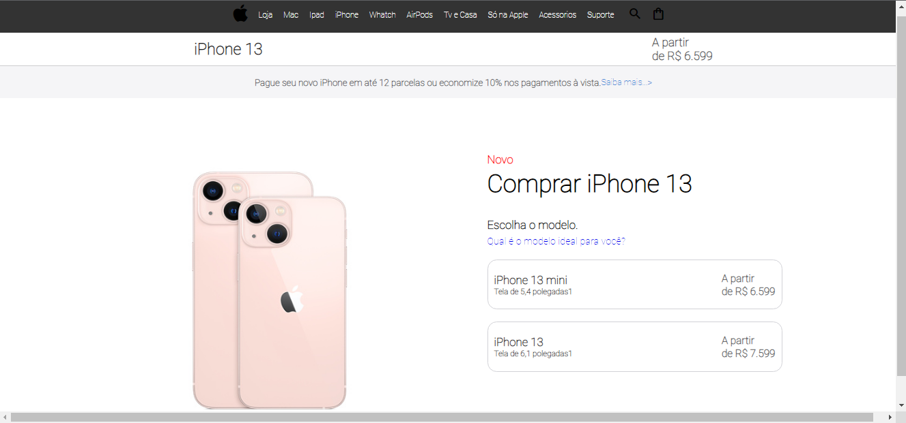

# 

<h1 align="center"> Projeto Site iPhone</h1>

<h1>
    
</h1>

 
# Indice

- [Sobre](#-sobre)
- [Tecnologias Utilizadas](#-tecnologias-utilizadas)

## 🔖&nbsp; Sobre

Esse é um Projeto onde faço uma Home Do Site da iPhone 13, onde utilizo HTML CSS, com o intuito de praticar o que venho estudando atualmente no curso de FullStack Jr na StakX.

---

## 🚀 Tecnologias utilizadas

O projeto foi desenvolvido utilizando as seguintes tecnologias

- HTML
- CSS

---

Desenvolvido por Lucas Gomes
